# baitap1
Bài tập về user, group, SSH
1/ Tạo 3 user(user-1, user-2, user-3), 2 group(groupA, groupB)

Add user

- sudo adduser user-1
- sudo adduser user-2

* sudo adduser user-3

Add group

- sudo groupadd groupA

* sudo groupadd groupB

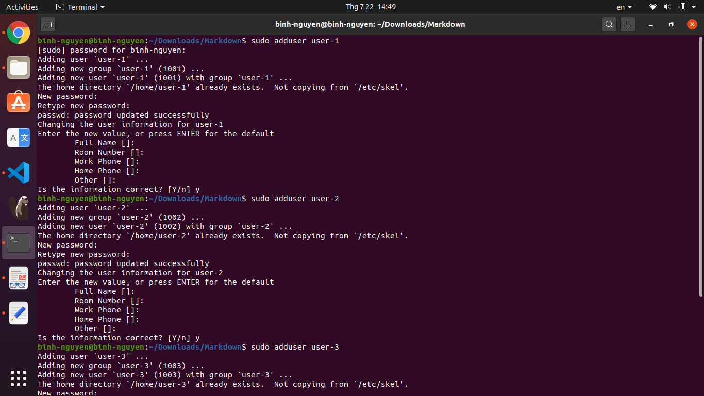

---

2/ Cho user-1, user-2 vào groupA, user-3 vào groupB

- sudo usermod -a -G groupA user-1

- sudo usermod -a -G groupA user-2

- sudo usermod -a -G groupB user-3
  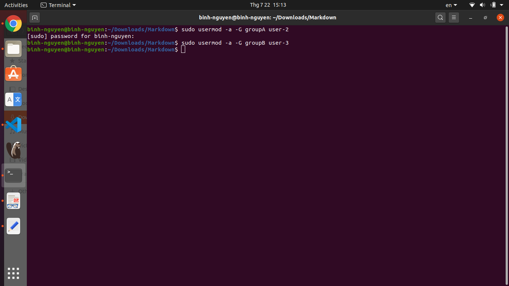

---

3/ Tạo file-a cho user-1 được 3 quyền (read write execute) và groupA chỉ có quyền read.

Tạo file-a.txt
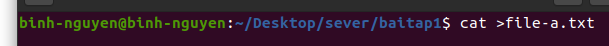

Đổi chủ sở hữu của file-a.txt thành user-1:groupB
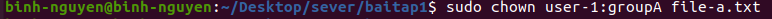

Cấp quyền
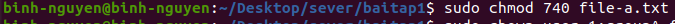

Xem quyền
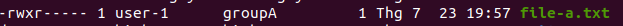

4/ Connect SSH (dùng password) từ máy mình đến một máy bất kì trong mạng (upload 1 file từ máy mình và download 1 file về máy mình)

Upload file

- scp test.txt user-1@192.168.0.48:nguyenthininhbinh.txt
  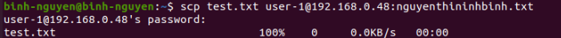

Downloadfile

- scp user-1@192.168.0.48:nguyenthininhbinh.txt test.txt
  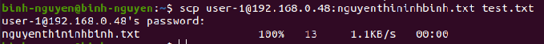

---

5/Tạo SSH key để đặng nhập vào server (một máy của bạn bất kì trong mạng) không dùng mật khẩu

Create SSH key

- ssh-keygen -t rsa -b 4096 -C "binh.nguyen24hdev@gmail.com"
  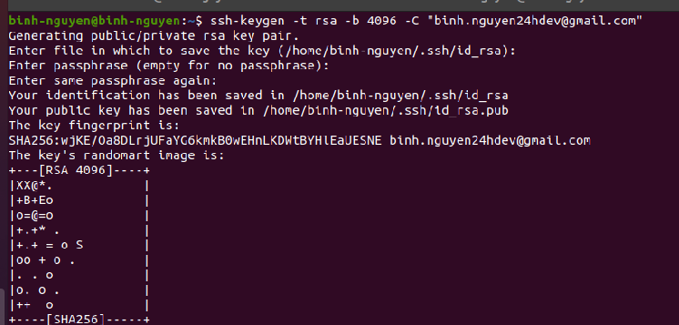

Thêm public key
cat ~/.ssh/id_rsa.pub | ssh user-1@192.168.0.48 "mkdir -p ~/.ssh && touch ~/.ssh/authorized_keys && chmod -R go= ~/.ssh && cat >> ~/.ssh/authorized_keys"

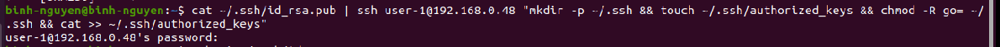

cach dang nhap khong can pass

- ssh -i ~/.ssh/id_rsa user-1@192.168.0.48

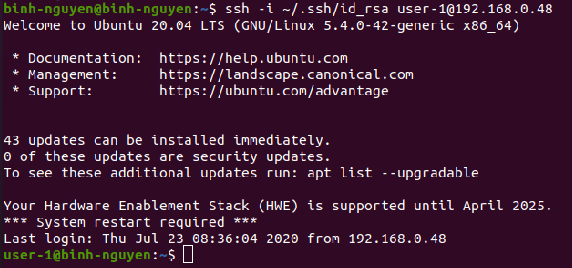

